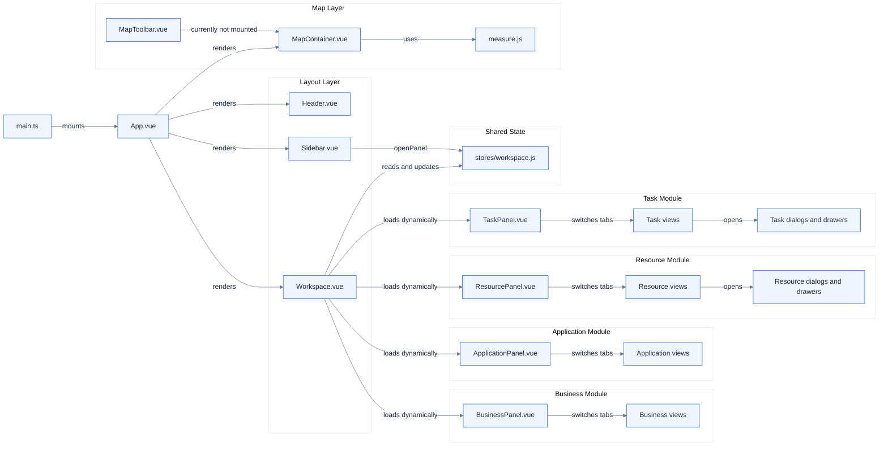
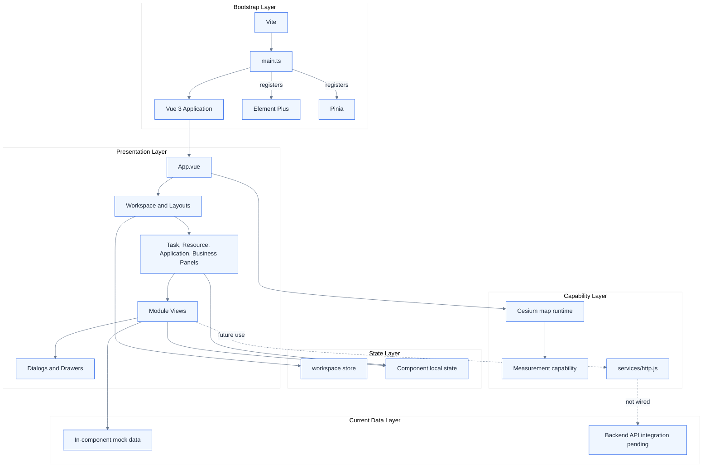

# Vue 3 Project Architecture

This document describes the current source structure and runtime relationships.
It reflects the implemented code only. Business functions remain inside Vue SFCs.

## Component Organization

## Vue 3 Technical Architecture Layers

## Current Boundary Notes

- `layouts/` owns the application shell and workspace behavior.
- `map/` owns Cesium rendering and measurement support.
- `modules/` owns business panels, views, dialogs, and drawers by domain.
- `stores/workspace.js` owns cross-component workspace state only.
- Most business data and functions remain local to the corresponding Vue component.
- `services/http.js` exists, but current module views still use in-component mock data.
